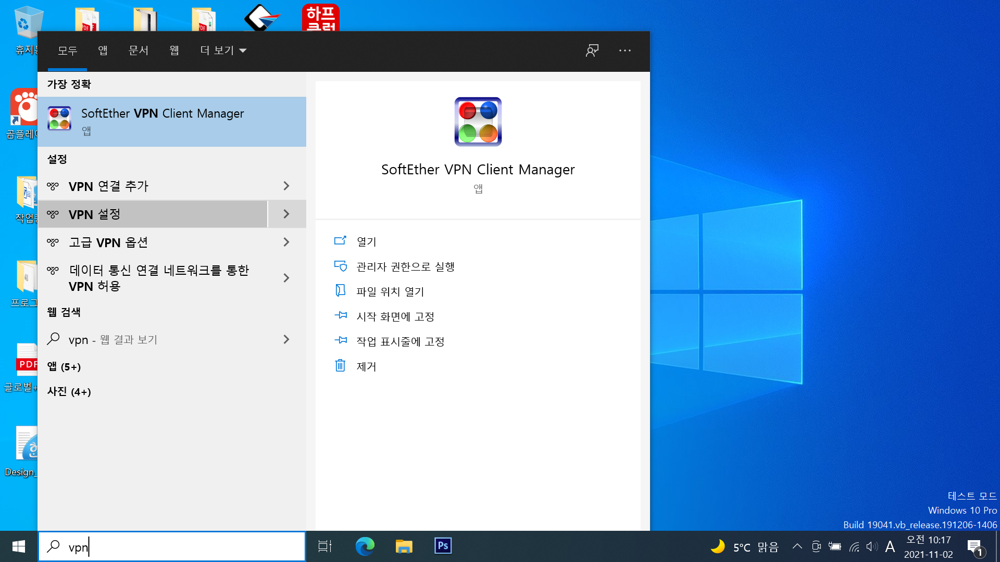
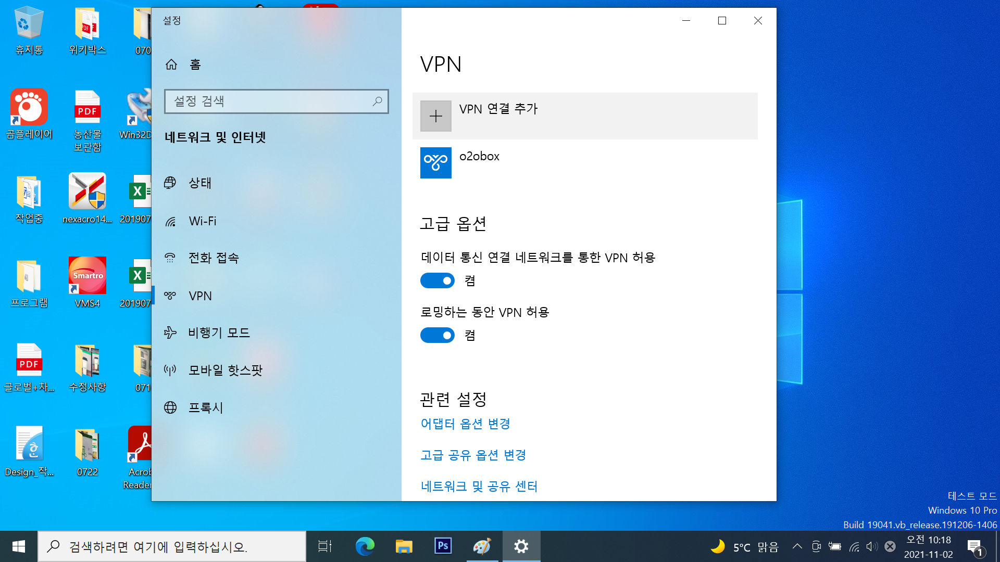
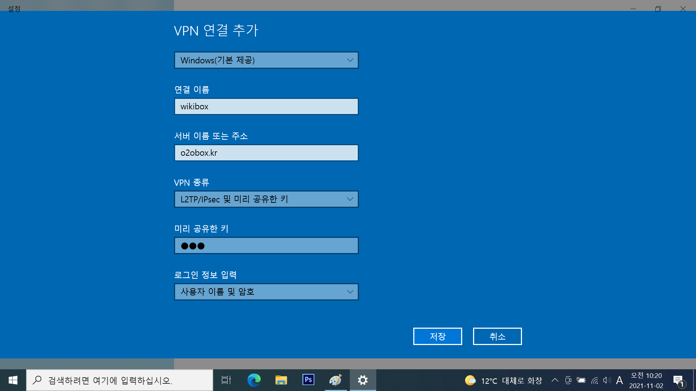
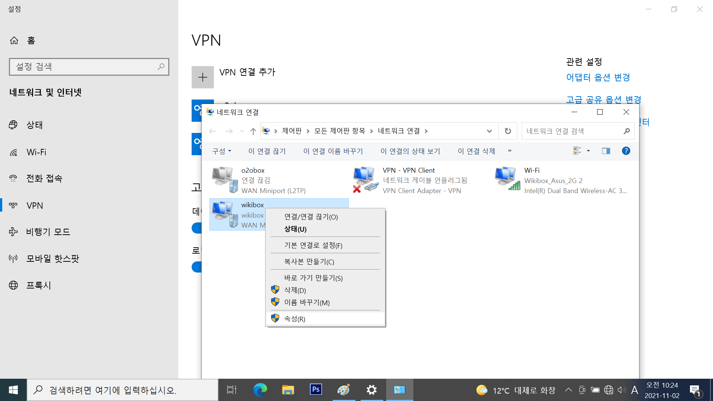
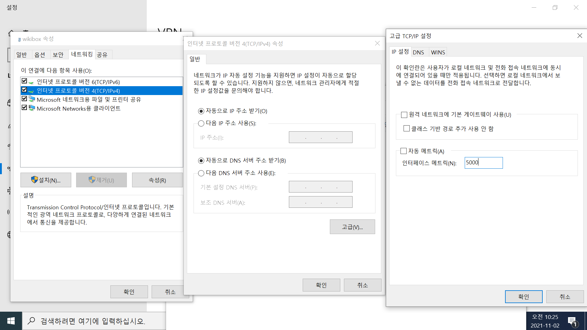
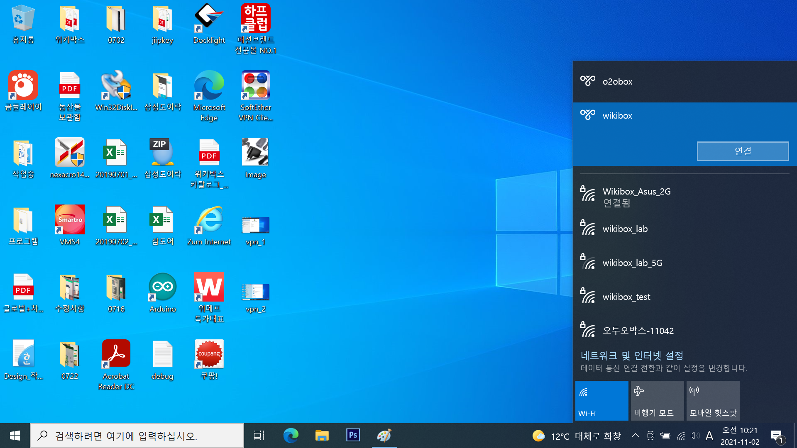
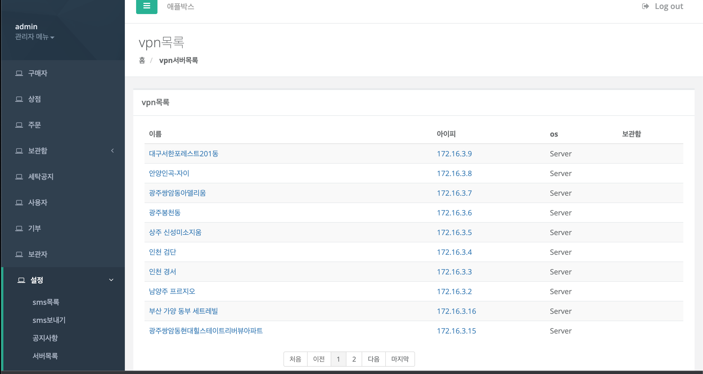

# 아파트 관리자 페이지 접속방법

  1. 윈도우 검색란에서 vpn 입력후 VPN 설정 클릭

  2. VPN 연결 추가 클릭

  3. 그림에 보이는 바와 같이 정보 입력. 
    
    미리 공유한 키: vpn
    로그인아이디:wikibox 
    로그인페스워드:dnlzlqkrtm 

  4. 오른쪽 상단 '어뎁터 옵션 변경' 클릭
 

  5. 보이는 화면 대로 정보 입력. 중간화면 고급... 클릭
 

  6. 오른쪽 하단창에 와이파이 아이콘 클릭후 wikibox 선택후 연결 클릭.

  7. 관리자페이지에 접속후 >설정>vpn목록 클릭후 항목을 클릭하면 아파트 관리자 페이지에 접속

  8. 컴퓨터 부팅시에 6,7번 순으로 실행하면 된다.
